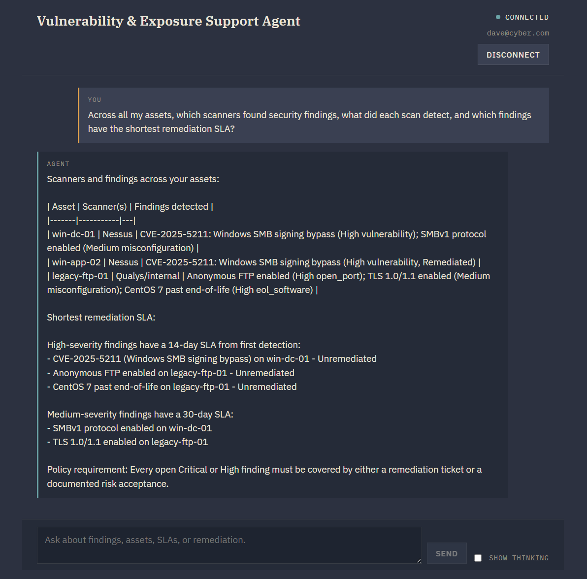

# Security Findings Agent

Ask security-hardening questions, retrieve findings on **your** assets, and open remediation tickets from a browser chat or CLI.

The system combines **policy RAG**, an **LLM tool-use loop**, and **MCP-backed SQLite access**. Answers are grounded in retrieved security policies and the authenticated user's own operational records.

> Educational project, not a production security platform. It queries stored scan results. It does not run vulnerability scans, install patches, or create tickets in Jira or ServiceNow.

## Demo


## What it does

- Answers hardening and remediation questions using local RAG over 21 security policy and remediation documents.
- Retrieves the authenticated user's assets, findings, scans, patch history, risk acceptances, and remediation tickets.
- Creates remediation tickets for the authenticated user's own assets.
- Supports findings beyond CVEs, including misconfigurations, exposed services, exposed data, and end-of-life software.
- Uses deterministic semantic validation to catch unsupported policy, ticket, patch-history, and remediation claims before returning a final answer.

### Agentic remediation workflow

The agent can maintain conversational context, identify the relevant finding, check existing remediation state, and create a remediation ticket through MCP.


## Example questions

```text
What vulnerabilities were found on server-prod-01?

Has this finding already been patched?

Is there an approved risk acceptance for this exposure?

What does our Linux hardening policy require?

How should I remediate this finding?

Open a remediation ticket for this issue.
```

### Multi-asset scan analysis

The agent can correlate owned assets, scan executions, findings, severity, remediation state, and organizational SLAs in one conversation.



## How it works


The shared agent core sends the conversation and available tool definitions to Anthropic. The model may request either a local policy-search tool or an operational MCP tool.

For a policy question, the core executes `search_policies` locally through `policy_retriever.py`, which embeds the query with `all-MiniLM-L6-v2` and retrieves relevant policy documents from embedded ChromaDB.

For operational data, the core executes an MCP tool through the MCP client/server boundary. The trusted application injects the authenticated `user_id`, and the MCP server performs ownership-scoped reads or remediation-ticket writes against SQLite.

Each tool result is returned to the model. The model can request additional tools, so the loop can alternate between RAG and operational data until enough grounded context has been collected. When the model produces final text, deterministic semantic validation checks the answer before it is returned to the user.

### RAG + MCP execution trace

With Show Thinking enabled, the browser displays a structured execution trace showing tool selection, authorization checks, retrieved evidence, policy retrieval, and semantic validation. It does not expose raw chain-of-thought.


### Access control

Authorization is enforced by application and database logic, not by asking the model to stay in scope. The trusted application layer injects the authenticated user identity, so text in the conversation cannot switch the user whose protected data is being accessed.


The MCP server trusts the application calling it and must remain private and inaccessible to untrusted clients.

For the detailed runtime loop, authentication flow, tool paths, and trust boundaries, see [Architecture](docs/architecture.md) and [Security](SECURITY.md).

## Quick start

For complete setup, including dependencies, the demo database, model download, and RAG indexing, see the [Installation guide](docs/installation.md).

Start the MCP server:

```bash
python mcp_server.py
```

Start the Web application in another terminal:

```bash
python -m uvicorn app:app --host 127.0.0.1 --port 8080 --workers 1 --log-level info
```

Open:

```text
http://127.0.0.1:8080
```

To use the CLI:

```bash
python main.py
```

Demo credentials and additional example prompts are available in the [User guide](docs/user-guide.md).

## Stack

Python 3.12 · Anthropic API · RAG · MCP · FastAPI · WebSocket · SQLite · ChromaDB · Sentence Transformers · bcrypt · JWT · AWS EC2

The application has been validated locally on Windows and on AWS EC2 with Ubuntu 24.04.

Docker packaging, a separate Web client/server architecture, and LiteLLM fallback are out of scope in this version.

## Documentation

| Document | Purpose |
|---|---|
| [Installation](docs/installation.md) | Environment, dependencies, demo data, and indexing |
| [User guide](docs/user-guide.md) | Sign-in, questions, tickets, and sessions |
| [Architecture](docs/architecture.md) | Components, agent loop, tool paths, data flow, and authorization boundaries |
| [EC2 deployment](docs/deployment.md) | AWS deployment and SSH forwarding |
| [Troubleshooting](docs/troubleshooting.md) | Common problems and recovery |
| [Validation](docs/validation.md) | Validation checklist and recorded results |
| [Course project specification](docs/project-specification.pdf) | Original course project specification |
| [Project requirements mapping](docs/project-requirements.md) | Domain adaptation and implementation mapping |
| [Security](SECURITY.md) | Security boundaries, limitations, and reporting |
| [Contributing](CONTRIBUTING.md) | Contribution workflow |
| [Changelog](CHANGELOG.md) | Project milestones |
| [Environment template](.env.example) | Configuration names and safe defaults |
| [License](LICENSE) | Project usage terms |

## Data handling and limitations

All seeded project data is synthetic.

Selected policy text, operational tool results, and conversation context can be sent to Anthropic to generate responses. Local SQLite and ChromaDB storage does not mean that all AI processing remains local.

Current limitations:

- Up to five authenticated Web sessions per process.
- Up to 20 conversation messages retained per session.
- Sessions are in memory; a restart drops them.
- Demo accounts intentionally share a known sample password. Do not expose the demo instance to untrusted users.
- AI-generated answers may be incomplete or incorrect and should be validated against source records and policies.

Never commit API keys, JWT secrets, `.env`, private keys, live databases, model caches, or sensitive logs.

## Project origin

The system was built from the same core architecture as the course's customer-support agent exercise, while the business domain was redesigned around vulnerability and exposure management.

| Original domain | Security domain |
|---|---|
| Customers | Users |
| Products | Findings |
| Orders | Assets |
| Order items | Scans |
| Shipments | Scan results |
| Returns | Risk acceptances |
| Payments | Patch history |
| Support tickets | Remediation tickets |

The agent loop, RAG, MCP-based database access, memory, Web and CLI interfaces, and ticket-write workflow remain the architectural foundation.

The security adaptation adds domain-specific policies and operational records, asset ownership, stronger authentication, authorization boundaries, remediation workflows, and deterministic semantic validation.

See the [original course project specification](docs/project-specification.pdf) and the [project requirements mapping](docs/project-requirements.md) for the source requirements and the cybersecurity adaptation.

## License

Copyright (c) 2026 Ory Yaffe Mordechai.

All rights reserved. Source is published for review; reuse requires permission.
