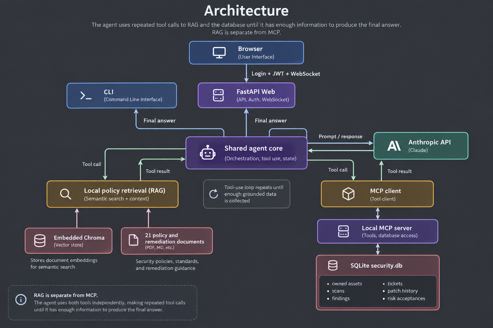
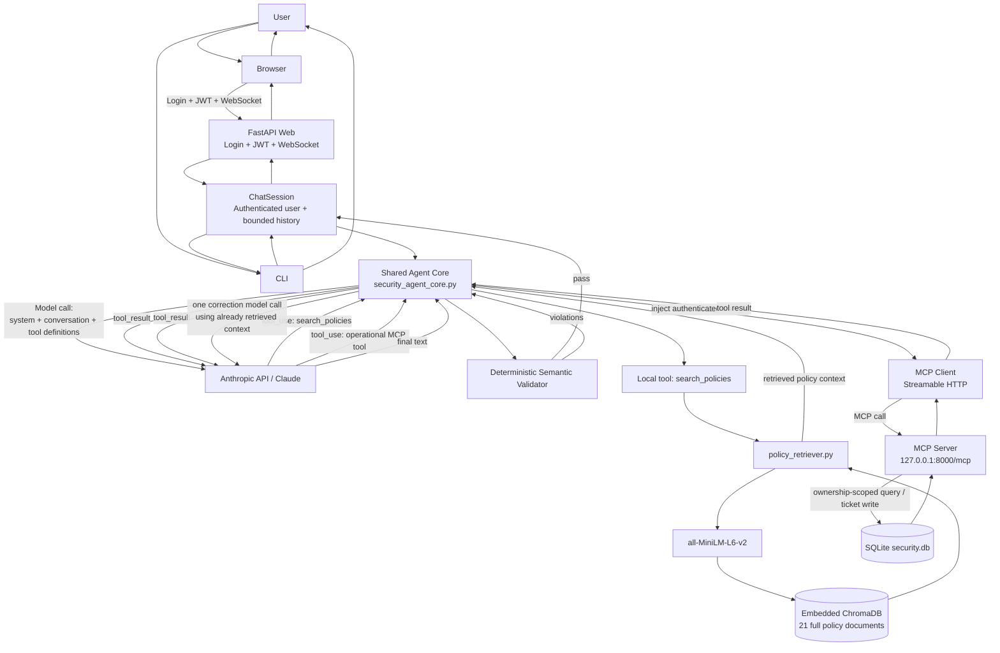

# Architecture

[Back to README](../README.md)

The application uses one shared agent core for both the browser and CLI. The LLM does not query ChromaDB or SQLite directly. Instead, it requests tools, the trusted application executes them, and the tool results are returned to the model. This loop can repeat until enough grounded information has been collected for a final answer.



## Runtime agent loop



The important distinction is that the agent has **two independent tool paths**:

- **Policy RAG:** `Agent Core -> search_policies -> policy_retriever.py -> Sentence Transformer -> ChromaDB`
- **Operational data:** `Agent Core -> MCP Client -> MCP Server -> SQLite`

ChromaDB is **not** accessed through MCP in this implementation.

The LLM can request either path multiple times within the same turn. Tool results are fed back to the model, and the loop continues until the model returns final text or the configured agent-round limit is reached.

## What happens in one turn

1. The Web or CLI passes the authenticated session and user message to the shared agent core.
2. The core sends the system prompt, bounded conversation history, current user message, and available tool definitions to Anthropic.
3. Anthropic may return a `tool_use` request.
4. If the tool is `search_policies`, the core executes local RAG retrieval.
5. If it is an operational tool, the core injects the authenticated `user_id` and calls it through MCP.
6. The result is appended to the current model conversation as a `tool_result`.
7. Anthropic is called again and may request additional tools.
8. When the model returns `end_turn`, the core extracts the final answer.
9. `validate_final_answer(...)` validates the answer against policy and operational evidence retrieved during the turn.
10. If violations are detected, one correction model call is allowed using the evidence already retrieved. No new tool calls are made during correction.
11. The corrected answer is validated again. If it still fails, the application returns a safe failure message instead of an unvalidated answer.

## Authentication and authorization

Authentication is separate from normal LLM tool use.

Web credentials are sent to `/auth/login`. Credential verification is performed through MCP, and bcrypt password comparison remains inside the MCP/database layer. After successful authentication, FastAPI issues a signed JWT. The JWT is presented as the first WebSocket authentication message, and the server creates a `ChatSession` containing the authenticated user identity.

The CLI authenticates through MCP as well, but does not use a JWT.

Authentication tools are removed from the normal LLM-visible tool list.

For protected operational calls:

```text
Authenticated session
        -> Agent Core
        -> LLM-visible MCP schema has no user_id
        -> Agent Core injects authenticated_user_id
        -> MCP Server
        -> ownership-scoped SQLite query
```

This means the model cannot choose another user's `user_id`.

## Runtime components

| Component | Responsibility | Process or storage |
| --- | --- | --- |
| `app.py` | HTML, login, JWT validation, WebSocket sessions | Uvicorn process |
| `main.py` | CLI interface and hidden password prompt | Separate process when using the CLI |
| `security_agent_core.py` | Shared LLM loop, tool dispatch, trace state, semantic validation | Imported by Web and CLI |
| `mcp_client.py`, `mcp_servers.yaml` | MCP Streamable HTTP transport and endpoint configuration | Imported library/configuration |
| `mcp_server.py` | Credential verification and user-scoped operational tools | Separate process |
| `policy_retriever.py` | Local embeddings and top-five policy retrieval | Embedded library |
| `session_manager.py` | Bounded in-memory conversation state | Per application process |
| `database/security.db` | Users and operational records | Persistent SQLite file |
| `chroma_db/` | Policy documents, metadata, and vectors | Persistent local directory |
| Model cache | `all-MiniLM-L6-v2` model files | Persistent user cache or configured `HF_HOME` |

`database/init_db.py` and `rag_build.py` are preparation tools, not persistent runtime services.

## RAG path

RAG indexes the 21 supplied policy documents as complete documents, without subchunking. Retrieval defaults to the top five relevant documents.

```text
LLM tool_use: search_policies
        -> Agent Core
        -> policy_retriever.py
        -> all-MiniLM-L6-v2 embedding
        -> embedded ChromaDB
        -> top policy documents
        -> Agent Core
        -> tool_result back to LLM
```

The Chroma client is embedded in the application. There is no separate Chroma network service.

## Operational MCP path

Runtime access to operational SQLite records is through MCP.

```text
LLM tool_use: operational MCP tool
        -> Agent Core
        -> authenticated user_id injected by trusted core
        -> MCP Client
        -> loopback MCP Server
        -> ownership-scoped SQLite query or ticket write
        -> MCP result
        -> Agent Core
        -> tool_result back to LLM
```

The MCP server is intentionally private. It trusts the authenticated identity supplied by the application layer and does not independently validate a JWT on every operational call.

## Semantic validation

The model's final text is not immediately returned to the user. The core performs deterministic checks against the evidence accumulated in the current turn.

The validator checks areas such as:

- policy-grounding and conditions
- SLA mappings and qualifiers
- ticket values and unsupported ticket actions
- patch-history field integrity
- risk-acceptance record integrity
- rescan and closure semantics
- cross-asset record separation

If the first final answer fails validation, the model receives a correction instruction containing the violations and the already retrieved context. The corrected answer is then validated once more.

## Session state

Each authenticated WebSocket connection receives an isolated `ChatSession`.

The session retains the last 20 normal user/assistant messages. Intermediate tool calls and tool results are not persisted in that bounded conversation history.

The current Web deployment uses a single worker. The five-session cap, sessions, and login rate-limit counters are process-local.

## Network boundaries

| Port | Purpose | Intended exposure |
| --- | --- | --- |
| 8000 | MCP at `http://127.0.0.1:8000/mcp` | Loopback only |
| 8080 | Web HTTP and WebSocket endpoint | Loopback only; reached through SSH port forwarding |
| 22 | SSH and port forwarding on EC2 | Administrator access path |

Browser and MCP application services remain on loopback in the validated EC2 deployment.

## External processing

Anthropic generates model responses using the conversation and selected retrieved content. The RAG database and embeddings are local, but the LLM itself is accessed through the Anthropic API.

The browser UI also references externally hosted Google Fonts.
