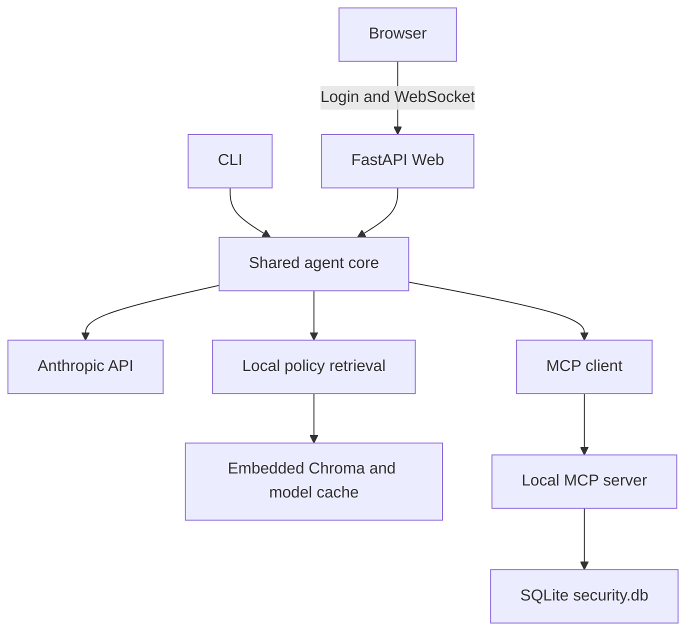

# Architecture

[Back to README](../README.md)

## Runtime components

| Component | Responsibility | Process or storage |
| --- | --- | --- |
| `app.py` | HTML, login, JWT validation, WebSocket sessions | Uvicorn process |
| `main.py` | Required CLI interface and hidden password prompt | Separate process when using the CLI |
| `security_agent_core.py` | Shared model loop, tool dispatch, policy/operational context | Imported by Web and CLI |
| `mcp_client.py`, `mcp_servers.yaml` | MCP transport and endpoint configuration | Imported library/configuration |
| `mcp_server.py` | Credential verification and operational tools | Separate process |
| `policy_retriever.py` | Embeddings and top-five policy retrieval | Embedded library |
| `session_manager.py` | Bounded in-memory conversation state | Per application process |
| `database/security.db` | Users and operational records | Persistent SQLite file |
| `chroma_db/` | Policy documents, metadata, and vectors | Persistent local directory |
| Model cache | `all-MiniLM-L6-v2` model files | Persistent user cache or configured `HF_HOME` |

`database/init_db.py` and `rag_build.py` are preparation tools, not persistent runtime services. No separate database or vector-database network service is required.

## Agentic loop and retrieval

Both interfaces invoke the shared agent core. The core sends the current conversation and tool definitions to the LLM. The LLM chooses whether to call the local policy-search tool or MCP operational tools, receives tool results, and continues toward a final response. A configured round limit bounds the loop.

The current source uses `AsyncAnthropic` and awaited MCP calls. Local policy retrieval is dispatched with `asyncio.to_thread` so model embedding/search work does not execute directly on the Web event-loop thread. This describes the implementation; it is not a claim that every library or SQLite operation is intrinsically asynchronous.

RAG indexes the 21 supplied policy documents as full documents, without splitting them into smaller chunks. Retrieval defaults to the top five relevant documents. `TOP_K` and the retriever's `top_k` argument control that value in code; there is no documented user-facing environment setting for it.

Runtime access to operational SQLite records is exclusively through MCP. Chroma policy retrieval is a local agent tool, not a SQLite query and not a separate MCP service. Database initialization is a separate setup operation.

The session history retains the last 20 user/assistant messages (up to 10 completed exchanges); intermediate tool messages are not retained in that persistent session history.

## Authentication and authorization

Web credentials reach `/auth/login`, which calls MCP credential verification. bcrypt hashes stay in the database/MCP layer and are not returned to the client. Web then issues a JWT, sent as the first WebSocket authentication message. The CLI authenticates through MCP without a JWT.

Authentication tools are excluded from the LLM tool list. For protected operational actions, the trusted core injects the authenticated user's identity and MCP queries enforce user scope. A shared finding-description catalog is distinct from user-owned asset records.

**Trust boundary:** the MCP endpoint does not independently authenticate the caller on every operational tool call. It trusts the user identity provided by its application client. It must remain local and inaccessible to untrusted callers; filtering by a supplied user ID is not a replacement for authenticating that caller.

## Differences from the course illustration

The course architecture illustration labels MCP transport as SSE and names the server `security_mcp_server.py`. This implementation uses Streamable HTTP at `/mcp` and names the file `mcp_server.py`. Both retain the MCP database-access boundary, but exact transport compliance with the illustration should be confirmed with the instructor if it is graded literally.

The starter policy document is listed under `dataset_design/` in the assignment. The current builder reads the runtime copy from `data/01_knowledge_base_documents.md`. Installation instructions use the actual code path.

## Network boundaries

| Port | Purpose | Intended exposure |
| --- | --- | --- |
| 8000 | MCP at `http://127.0.0.1:8000/mcp` | Loopback only |
| 8080 | Web HTTP and WebSocket endpoint | Loopback only; reached through SSH port forwarding |
| 22 | SSH and port forwarding on EC2 | Administrator's public IP only; used for the validated SSH port-forwarding access path |

The browser uses relative URLs and derives WebSocket host/protocol from the page location. When a TLS reverse proxy is used, it must support WebSocket upgrades.

## State and concurrency

Run a single Web worker. Sessions, the five-session cap, and login rate-limit counters are process-local. Multiple workers would each have their own counters and session state.

SQLite and Chroma data persist on disk; conversation history does not. Model loading in separate CLI and Web processes duplicates memory use. During the EC2 demo run (1.9 GiB RAM, no swap), MCP and Web were active with about 1.4 GiB in use and roughly 490 MiB available. Browser login/Q&A was exercised without a concurrent CLI process; running CLI alongside Web would add memory pressure. See [EC2 deployment](deployment.md).

## External processing

Anthropic generates responses using conversation and selected retrieved content. Local RAG is not equivalent to an entirely local AI system. The HTML also references externally hosted Google Fonts.
